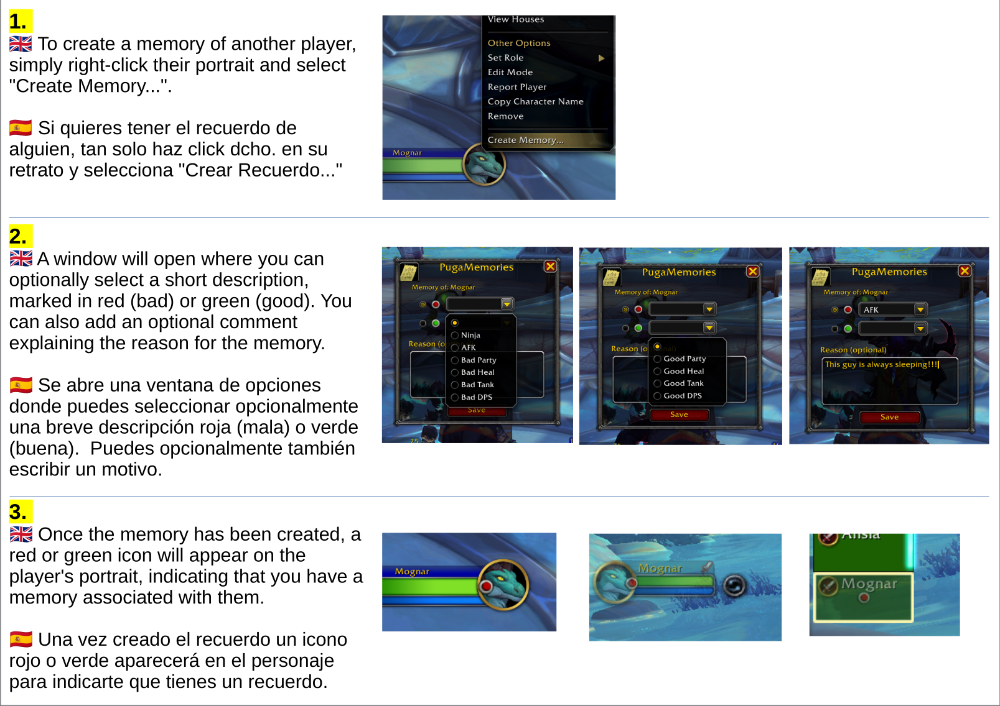
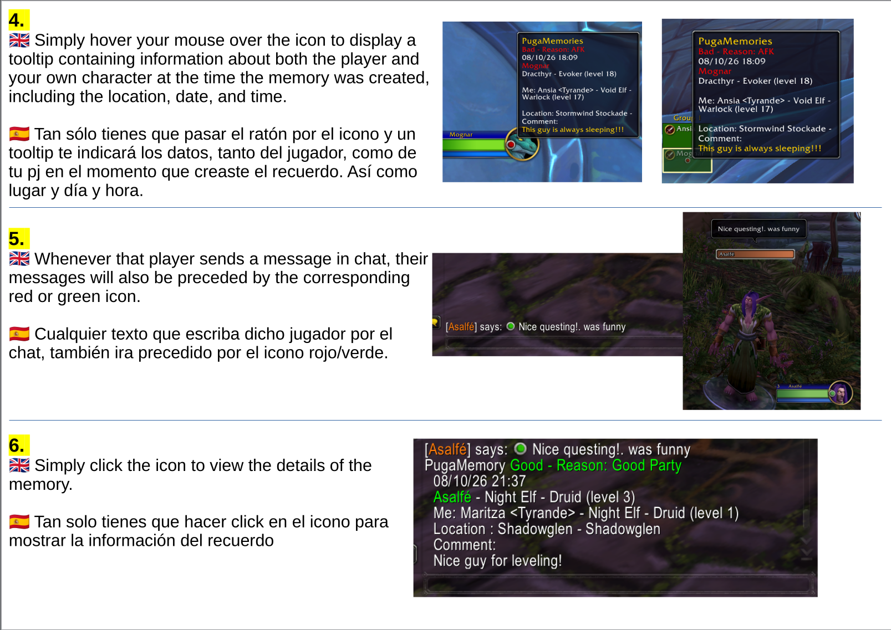

# PugaMemories 
A World of Warcraft Addon

## ENGLISH

PugaMemories is a World of Warcraft addon that lets you save personal notes about other players, marking your experiences with them as positive (green) or negative (red).

Right-click a player's portrait and select "Create Memory..." to save a memory. You can choose a reason and add an optional comment.

Each memory automatically records information about both characters, including their names, races, classes, levels, location, and the date and time of the encounter.

When you meet that player again:

- A green or red icon appears on their portrait, including party and raid frames.
- Hover over the icon on the portrait to see the saved memory's details in a tooltip.
- The same icon appears next to their messages in chat.
- Click the icon in chat to view the saved memory's details.

All memories are stored locally and are for your personal use.

--------------------------------------------------

## ESPAÑOL

PugaMemories es un addon para World of Warcraft que permite guardar notas personales sobre otros jugadores, clasificando las experiencias con ellos como positivas (verde) o negativas (rojo).

Haz clic derecho sobre el retrato de un jugador y selecciona "Crear Recuerdo..." para guardar un recuerdo. Puedes seleccionar un motivo y añadir un comentario opcional.

Cada recuerdo registra automáticamente información sobre ambos personajes, incluyendo sus nombres, razas, clases, niveles, ubicación y la fecha y hora del encuentro.

Cuando vuelvas a encontrarte con ese jugador:

- Aparecerá un icono verde o rojo en su retrato, incluidos los marcos de grupo y banda.
- Pasa el ratón sobre el icono del retrato para consultar los detalles del recuerdo mediante un tooltip.
- El mismo icono aparecerá junto a sus mensajes en el chat.
- Haz clic en el icono del chat para consultar los detalles del recuerdo guardado.

Todos los recuerdos se almacenan localmente y son exclusivamente para uso personal.

--------------------------------------------------

## PORTUGUÊS

PugaMemories é um addon para World of Warcraft que permite guardar notas pessoais sobre outros jogadores, classificando as experiências com eles como positivas (verde) ou negativas (vermelho).

Clica com o botão direito do rato no retrato de um jogador e seleciona "Create Memory..." para guardar uma memória. Podes escolher um motivo e adicionar um comentário opcional.

Cada memória regista automaticamente informações sobre ambas as personagens, incluindo os seus nomes, raças, classes, níveis, localização e a data e hora do encontro.

Quando voltares a encontrar esse jogador:

- Aparecerá um ícone verde ou vermelho no seu retrato, incluindo nos quadros de grupo e raide.
- Passa o rato sobre o ícone no retrato para consultares os detalhes da memória numa descrição.
- O mesmo ícone aparecerá junto às suas mensagens no chat.
- Clica no ícone do chat para consultares os detalhes da memória guardada.

Todas as memórias são guardadas localmente e destinam-se exclusivamente a uso pessoal.

--------------------------------------------------

## FRANÇAIS

PugaMemories est un addon pour World of Warcraft qui permet d'enregistrer des notes personnelles sur d'autres joueurs, en classant les expériences vécues avec eux comme positives (vert) ou négatives (rouge).

Faites un clic droit sur le portrait d'un joueur et sélectionnez « Create Memory... » pour enregistrer un souvenir. Vous pouvez choisir un motif et ajouter un commentaire facultatif.

Chaque souvenir enregistre automatiquement des informations sur les deux personnages, notamment leurs noms, races, classes, niveaux, ainsi que le lieu, la date et l'heure de la rencontre.

Lorsque vous croisez à nouveau ce joueur :

- Une icône verte ou rouge apparaît sur son portrait, y compris dans les cadres de groupe et de raid.
- Survolez l'icône du portrait avec la souris pour consulter les détails du souvenir dans une infobulle.
- La même icône apparaît à côté de ses messages dans le chat.
- Cliquez sur l'icône dans le chat pour consulter les détails du souvenir enregistré.

Tous les souvenirs sont enregistrés localement et sont destinés exclusivement à votre usage personnel.

--------------------------------------------------

## DEUTSCH

PugaMemories ist ein Addon für World of Warcraft, mit dem du persönliche Notizen über andere Spieler speichern und deine Erfahrungen mit ihnen als positiv (grün) oder negativ (rot) kennzeichnen kannst.

Klicke mit der rechten Maustaste auf das Porträt eines Spielers und wähle „Create Memory...“, um eine Erinnerung zu speichern. Du kannst einen Grund auswählen und optional einen Kommentar hinzufügen.

Jede Erinnerung speichert automatisch Informationen über beide Charaktere, darunter Namen, Völker, Klassen, Stufen sowie Ort, Datum und Uhrzeit der Begegnung.

Wenn du diesem Spieler erneut begegnest:

- Ein grünes oder rotes Symbol erscheint auf seinem Porträt, auch in Gruppen- und Schlachtzugsfenstern.
- Bewege den Mauszeiger über das Symbol auf dem Porträt, um die Details der Erinnerung in einem Tooltip anzuzeigen.
- Dasselbe Symbol erscheint neben seinen Nachrichten im Chat.
- Klicke auf das Symbol im Chat, um die Details der gespeicherten Erinnerung aufzurufen.

Alle Erinnerungen werden lokal gespeichert und sind ausschließlich für deinen persönlichen Gebrauch bestimmt.

